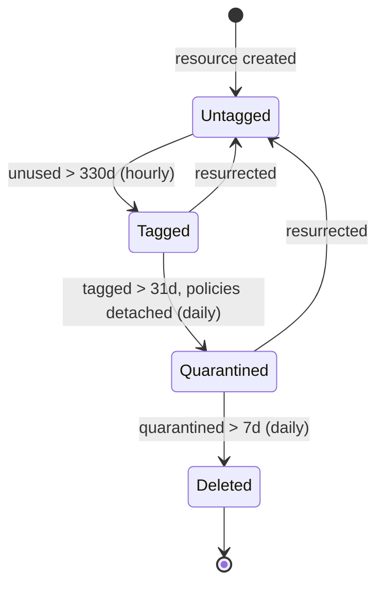

## TL;DR

I built a Cloud Custodian pipeline that has deleted roughly 10,000 unused
resources across a multi-account cloud estate and continues to delete more
every day. The same four-stage state machine (tag, resurrect, quarantine,
delete) handled eight resource types: IAM roles, security groups, elastic
IPs, EBS volumes, RDS instances, ELBs, old snapshots, and NAT gateways.
The filters change per resource type. The shape does not.

The most interesting case was IAM roles, which get a deep dive below. The
short version: about one in five was unused, and the dangerous category
was roles whose trust policies pointed at external accounts the org no
longer engaged with. CSPM tools do not flag those.

If you take one thing from this post: manual cleanups are events; the
pipeline is the control. Cloud Custodian's combination of filters, tags,
and rate-limited actions is well-shaped for "find unused resources of
type X" problems, and the second pipeline is mostly a copy-paste of the
first.

| Outcome | What it means |
|---|---|
| ~10,000 unused resources deleted and counting | Continuous cleanup, not a one-time audit |
| 8 resource types covered: IAM roles, SGs, EIPs, EBS, RDS, ELBs, snapshots, NAT gateways | One pattern, many resource types |
| Rate-limited deletions: only a fraction of tagged resources per run | Mistakes are bounded; rollback is feasible |
| Audit-flagged high-privilege roles cleaned up as a side effect | Shorter, defensible administrator list at next review |
| c7n-org runs multi-account on an hourly GitHub Action cron | Hygiene is infrastructure-as-code; no persistent infra to maintain |

## Why this matters

Cloud estates grow outward. New accounts, new buckets, new roles, new
compute. Each addition has a clear owner on day one. A few years later, a
large chunk of the surface area is dead. Unused IAM roles, security groups
attached to nothing, EBS volumes detached from any instance, RDS instances
nobody connects to, NAT gateways racking up charges for traffic that no
longer flows.

Most CSPM tools score resources by configuration: are the security group
rules valid, is the IAM trust policy syntactically correct, does the
snapshot have encryption. A security group with one ingress rule on port
22 to `0.0.0.0/0` is scored correctly. A security group attached to
nothing, with the same rule, is also scored correctly. The configuration
is identical. The difference is whether it is in use.

The unused-and-forgotten category is invisible to compliance tooling. It
is also where most of the abandoned attack surface lives. Each unused IAM
role is a dormant pivot. Each unused security group with a stale rule is
a misconfiguration waiting to be re-attached to something. Each abandoned
snapshot is data nobody is tracking. Each unused NAT gateway is a
recurring bill and an unmonitored egress path.

The headline risk is "too many resources." The real risk is the long tail
nobody can defend.

## What I did

**Goal**: build automation that continuously cleans up unused resources
across a multi-account cloud estate without breaking anything still in
use.

Built a Cloud Custodian pipeline that runs across every AWS account in
the org and looks for unused resources across eight types:

- **IAM roles**: no principal calls in the last 330 days
- **Security groups**: not attached to any ENI, with exceptions for `default`
  and Kubernetes-managed patterns
- **Elastic IPs**: unattached
- **EBS volumes**: detached
- **RDS instances**: no recent connections (database engine metric)
- **ELBs**: classic, application, and network load balancers with no targets
- **EBS snapshots**: orphaned (source volume deleted) and older than threshold
- **NAT gateways**: in subnets with no active workloads routing through them

Each resource type has its own policy, but the shape is the same: tag
when first found, remove the tag if the resource comes back into use,
quarantine after a buffer period, delete after a further buffer. The
thresholds vary (security groups can move faster than IAM roles; EIPs go
quickly; RDS deserves a longer buffer).

Cumulative pipeline output: about 10,000 deletions across all resource
types since deployment, and the number continues to grow every day.

## How I did it: a four-stage state machine in Cloud Custodian

I used [Cloud Custodian](https://cloudcustodian.io/) (`c7n`) with
[c7n-org](https://cloudcustodian.io/docs/tools/c7n-org.html) for
multi-account orchestration. The whole thing runs in a GitHub Action
on an hourly cron schedule. No persistent infrastructure, no Lambda,
no dedicated cron host. The runner spins up, evaluates the policies
across every account in the org, takes actions, posts notifications to
Slack, and exits.

The pipeline is a four-stage state machine where the state is encoded
as AWS tags on each resource. No external database, no separate
workflow engine. Tags do the work.



The resurrect transition is the safety net. Anyone who exercises the
resource at any stage before deletion bumps it back to Untagged and
starts the inactivity clock over.

The four stages, using IAM roles as the example:

### Stage 1: tag (hourly)

Find resources matching the "unused" criteria, exclude well-known
exceptions, tag them with `cc-unused-found-date: {now}`.

```yaml
- name: iam-role-unused-tag
  resource: iam-role
  description: Tag IAM roles unused for more than 330 days
  conditions:
    # IAM is a global service. Only run in us-east-1 to avoid
    # one redundant pass per region.
    - region: us-east-1
  filters:
    - "tag:cc-unused-found-date": absent
    - "tag:cc-ignore": absent
    - or:
      - and:
        - 'RoleLastUsed.LastUsedDate': empty
        - type: value
          key: CreateDate
          op: greater-than
          value_type: age
          value: 330
      - type: value
        key: 'RoleLastUsed.LastUsedDate'
        value_type: age
        value: 330
        op: greater-than
    - not:
      - or:
        - type: value
          key: 'RoleName'
          op: regex
          value: '^AWSReservedSSO_.*'
        - type: value
          key: 'Arn'
          op: contains
          value: '/aws-service-role/'
  actions:
    - type: tag
      tags:
        cc-unused-found-date: "{now}"
```

### Stage 2: resurrect (hourly)

If a tagged resource becomes active again or turns out to be recently
created, remove the tag. This is the safety net. Anyone who exercises the
resource during the quarantine window buys it another full inactivity
threshold.

### Stage 3: quarantine (daily, after the buffer period)

If a resource has been tagged for more than the buffer period and no
resurrection happened, neuter it without deleting it. The mechanism
depends on the resource type:

- **IAM role**: detach every attached policy. The role still exists; it
  just cannot do anything.
- **Security group**: revoke every ingress and egress rule.
- **EBS volume / snapshot**: tag for deletion; lifecycle policies handle
  the actual removal.
- **RDS**: stop the instance.
- **NAT gateway / EIP / ELB**: usually skipped (move directly to delete
  after the longer inactivity threshold).

Tag with `cc-detach-policy-date: {now}` and post a Slack notification.

This is the most important step. A loud failure during quarantine (an
`AccessDenied` in someone's CI logs, a `ConnectionRefused` from a stopped
RDS) is recoverable. A silent deletion of a still-used resource is not.

### Stage 4: delete (daily, after a further buffer)

If the resource has been in the quarantine state without resurrection,
delete it. Post another Slack notification.

For IAM roles, the total quarantine window is roughly 38 days on top of
the 330-day inactivity threshold. A role has to be genuinely abandoned
for over a year before deletion.

### Rate-limited deletion

A Cloud Custodian `reduce` filter caps the number of resources processed
per run. Without it, the first run after deployment would attempt to
delete every tagged resource at once. With it, the deletion is throttled
to a controlled fraction per run, spreading any unintended consequences
across days instead of minutes.

```yaml
- type: reduce
  order: randomize
  limit-percent: 5
```

If a percent is set to 5, a fully-tagged backlog of a thousand resources
takes about twenty days to fully process. Anyone affected has a long
window to surface a complaint before the next batch goes through. When
something does break, the blast radius is one batch, not the entire
backlog.

### Why tag-based state is the right model

The pipeline has no external state store. Each resource's progression
through the stages is encoded in tags on the resource itself. AWS APIs
are authoritative; the state machine cannot drift away from reality. If
someone manually removes a tag, the resource re-enters the pipeline from
the start. If someone manually deletes a resource, the pipeline never
sees it again.

Slack notifications at quarantine and delete give operators a continuous,
low-noise view of what the pipeline is doing without anyone needing to
open a dashboard.

## Deep dive: the IAM role case

IAM roles deserve their own section because the failure mode is more
interesting than "this resource is unused, delete it."

About one in five IAM roles in the org was unused. Most were boring:
vendor integrations that ended, personal AWS accounts of engineers who
had left, third-party tools the org no longer paid for. The first
thousand deletes were fast.

The interesting category was roles with trust policies pointing at
external accounts the org no longer engaged with. The role itself was
technically perfect: a syntactically valid trust policy, IAM conditions
in place, no wildcards on resource. But the AWS account ID in the trust
policy was for a vendor we stopped using two years ago. The vendor has
long since cycled out their AWS accounts. The role is one credential
leak away from being someone else's pivot into the cloud estate.

CSPM tools do not flag this. The configuration is correct. The intent is
gone.

Pruning these required cross-referencing every role's trust policy
against the vendor inventory and the departed-employee list. The first
pass has to happen by hand. After that, you can maintain a list of
"external accounts we still trust" and let the policy flag anything
outside it.

### Side benefit: shorter list for the auditors

The cleanup had a downstream benefit nobody planned for. Compliance and
external auditors had flagged a recurring set of high-privilege roles
during prior reviews. Most of those were not roles people were actively
using; they were roles attached to systems that no longer ran. The
pipeline either deleted them outright or surfaced them for explicit
downscoping as part of the broader review.

By the next audit cycle, the list of administrators had three
categories: currently used roles, CI/CD roles, and a small number of
break-glass roles. Each easy to justify. The category that auditors care
most about, and engineers can least defend ("why does this dormant role
have admin?"), no longer existed.

## Cost impact

IAM roles and security groups are free; deleting them does not reduce
the AWS bill. The other six categories do. Using estimated counts based
on the 10,000-resource total and public AWS list prices (us-east-1):

| Resource type | Estimated count | Annual list price each | Estimated annual savings |
|---|---|---|---|
| IAM roles | ~5,000 | $0 | $0 |
| Security groups | ~2,500 | $0 | $0 |
| EBS snapshots (~100 GB avg) | ~1,500 | ~$60 | ~$90k |
| EBS volumes (~200 GB avg, gp3) | ~500 | ~$192 | ~$96k |
| Elastic IPs (unattached) | ~200 | ~$44 | ~$9k |
| ELBs (base hourly) | ~200 | ~$197 | ~$39k |
| RDS instances (small-tier avg) | ~50 | ~$840 | ~$42k |
| NAT gateways (base hourly) | ~50 | ~$394 | ~$20k |
| **Total** | **~10,000** | | **~$300k/year** |

A few caveats. These are list-price estimates, not invoice numbers.
Reserved instance commitments, savings plans, and inter-region
variations all bend real spend lower. The math is also
order-of-magnitude across a long tail of resource sizes, not a precise
audit. The point is the shape: most of the savings come from a small
number of expensive resources (RDS, NAT gateways) and a long tail of
medium-priced ones (volumes, snapshots), not from the bulk of the
cleanup (IAM roles and security groups).

This was not the reason to do the cleanup. The security argument
(dormant attack surface) and the operational argument (continuous
hygiene instead of one-off audits) are the load-bearing ones. The cost
recovery is a side benefit that makes the project easier to justify in
budget review.

## What I would do differently

**Ship the pipeline first in dry-run, let it produce the audit candidate
list.** The audit gave me confidence in the approach. The pipeline is
what does the work. Building them in that order made sense at the time
but reversed the leverage: I spent audit hours hand-rolling queries the
pipeline would have produced for free. Deploy the pipeline in dry-run
from day one, review the candidates in batches, then enable the
quarantine and delete actions once the candidate list looks right.

**Add the rate limiter before the first delete, not after the first
incident.** I learned the value of the `reduce` filter the way these
things are usually learned: by deleting too many resources too fast on a
non-prod account. Set the percent low from day one; you can raise it
once the operational confidence is there.

**Lean harder on c7n's built-in patterns.** Two specifics. First, use
[`mark-for-op`](https://cloudcustodian.io/docs/aws/resources/iam-role.html#actions)
to encode both the operation and the scheduled date in a single tag
value (`c7n_status: detach-policy@2025-04-15`) instead of custom date
tags like `cc-unused-found-date`. The mark-for-op convention makes
filter logic shorter and the operator intent self-documenting. Second,
when rate-limiting via `reduce`, use
`sort-by: 'RoleLastUsed.LastUsedDate'` with `value_type: date` and
`sort-order: asc` instead of `order: randomize`. Oldest-unused-first
deletes the highest-confidence candidates first; random order will
occasionally delete a borderline role before a five-year-dormant one.

**Tag enforcement at resource creation, not just at cleanup time.** The
least productive hour of any cleanup is the one spent chasing down who
owns a resource created by an engineer who left two years ago. Require
owner tags via service control policies or Terraform module conventions
at creation time, and the cleanup pipeline can route notifications to
the actual owner instead of guessing.

## Takeaways

- **Manual cleanups are events; the pipeline is the control.** A
  one-time audit gets the estate to a defensible baseline. Continuous
  automation keeps it there.
- **Tags as state are durable.** No external store, no drift, no
  separate workflow engine. The cloud APIs are authoritative.
- **Quarantine by neutering, not by deleting.** Detach policies, revoke
  rules, stop instances. If someone tries to use the resource, they get
  a loud, recoverable failure rather than a silent disappearance.
- **The pattern generalizes.** The same four-stage shape extends almost
  unchanged across IAM roles, security groups, EIPs, EBS volumes, RDS,
  ELBs, snapshots, and NAT gateways. Write the first pipeline well; the
  rest are filter swaps.
- **CSPM scores configuration; pipelines score intent.** A role whose
  intent has expired is invisible to compliance tooling. Continuous
  cleanup is how that gap closes.
